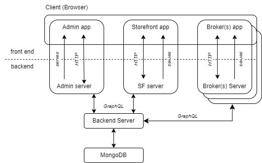

# IIP-Ecosphere Data Marketplace

Development of a prototype data marketplace solution for the IIP-Ecosphere ecosystem.

## Getting started for development

### Marketplace

The marketplace system is composed of 5 components, as shown schematically in the figure below. The architecture follows
the
classic client-server paradigm, where three browser applications act as clients and communicate with the servers they are
served on.
The corresponding servers act as proxies and take the client role to propagate requests/responses from/to the main
backend application.
MongoDB operates as a persistent storage to store and manage data.



#### Admin

The Admin application is a browser application used by the marketplace administrator.
The Admin UI allows to manage the digital assets and accounts, publish assets to catalog, configure marketplace
preferences, process orders, etc.

The App is build with Nuxt 3 and uses Vuetify 3 for UI components. Nuxt server serves the pre-rendered Vue pages and
also exposes
an REST API. This API acts as the proxy between the Admin browser app and the Backend Server, while abstracting the
details of
the Backend GraphQL API and taking care of the authentication, headers etc. This paradigm helps to reduce the direct
dependency
of the webapp on the Backend Server and increases the security of the communication, as the details of the data exchange
are hidden in the Nuxt server and never exposed to the client. Following this communication pattern, the Nuxt server
takes the
request from the UI components, converts them to GraphQL queries or mutations, propagates the request to Backend Server,
prepares
the response by extracting required data and propagates it back to the components.

⛏ Nuxt 3, Vue 3, Vuetify 3, TypeScript

#### Storefront

The Storefront (SF) application is a user interface application that provides access to the store interface of the marketplace. 
It acts similar to a traditional e-commerce shop, as it presents the catalog of products or services that the marketplace 
offers to its customers. The SF application allows customers to browse through the products or services, view their 
details and pricing, and place orders. The SF application communicates with the backend server to retrieve data and process orders.

The storefront is built with [Vue Storefront 2](https://vuestorefront.io/) with Nuxt 2 and their own UI library under
the hood.
The project structure of the app is driven by Vue Storefront. The structure of the Admin App was also inspired by Vue
Storefront,
but with drastic simplification and utilization the cutting edge technologies. It also means that the communication of
the
storefront Webpages with the Nuxt server follows the same paradigm as in the Admin project.

⛏ Nuxt 2, Vue-Storefront 2, Tailwindcss 3, TypeScript

#### Backend Server

The Backend Server contains the core logic of the data marketplace and exposes an GraphQL API that is utilized by
the Admin and SF applications. The project is based on the [Mailchimp](https://github.com/reactioncommerce/reaction)
with custom
plugins on top. To gain more flexibility, the project manually imports the `@reactioncommerce/api-core` and other
plugins.

⛏ Nodejs 14, Mailchimp (reactioncommerce),

#### Broker

The Broker acts as a central coordinator between multiple deployed Marketplace instances (Nodes) to facilitate distributed 
access to digital assets. It is a stateless SSR application that keeps a list of known Nodes, including information about 
their APIs and storefronts. To list the offered Assets, the Broker aggregates offers from the known Nodes. It does not 
store any data and doesn't implement shopping-related functionality. By default, only public assets are listed, but 
restricted assets can be accessed by authenticated users.
To prevent abuse, Nodes manage the list of known Brokers where they are participating, and the Broker should provide an 
endpoint where the participating Nodes can verify that the request is originating from it.

⛏ Nuxt 3, Vue 3, ElementUI, TypeScript

### Get up and running locally

#### Requirements

+ Node 14.x to run server (exact 14.x, [issue](https://github.com/reactioncommerce/reaction/issues/6396))
+ Node 16.x to run client applications (Storefront and Admin)
+ yarn 2
+ Docker/Docker Compose

#### Install dependencies

In the root `package.json` you will find several useful scripts. To install dependencies in all projects run:

```bash
yarn run init
```

#### Run services

In the root `package.json` you will find the required scripts:

```bash
# server, make sure to use Node 14
yarn run dev:server
# admin
yarn run dev:admin
# storefront
yarn run dev:storefront:theme
# optionally, you can start the storefront api and composables, if you plan to make changes in these packages
yarn run dev:storefront:api # for hot reload, theme package requires restart for the changes to make effect!!!
yarn run dev:storefront:composables # for hot reload
```

Don't forget to start the MongoDB instance. Also you should do this before starting the `server`. It's done with the
provided
Docker Compose configuration:

```bash
cd docker
docker compose up -d mongo
```

#### Check services

Now, if anything is working correctly, by default the services should be available at:

+ Backend Server: http://localhost:3000, GraphQL playground- http://localhost:3000/graphql
+ Admin: http://localhost:5000
+ Storefront: http://localhost:8080

#### Working with Docker

In certain situations, you may need to run some services locally while allowing others to run in containers. For
instance,
you may wish to develop an admin app locally while running the other services in containers. In such a case, it is
essential
to configure Docker Compose networking appropriately and forward ports from the containers to the system host.
Instructions
for achieving this can be found in the [`docker`](./docker) directory, along with additional details on building and
pushing Docker images.

## Production (like) deployment with Docker

In this section, we will guide you through the process of preparing your Docker deployment for production. Essentially,
the process involves deploying four different applications and a MongoDB instance, and then making the system available
to the world via a reverse proxy.
To get started with the Marketplace system, follow these steps:

### 1. Prerequisites

Make sure you have the following installed on your machine:

+ Docker
+ Docker Compose
+ Git

### 2. Clone the Repository

Clone the marketplace repository from Gitlab, ask us to get access.

### 3. Set Up Environment

From now on we a working in the `/docker` directory. Copy the `.env.example` file to `.env`:

```shell
cd docker
cp .env.example .env

```

The ENV variables specified in the docker-compose file allow for the dynamic configuration of the containers at
runtime. This means that the same container image can be used in multiple environments with different
configurations simply by setting different environment variables.

Here is a breakdown of the deployment instructions for each service:

#### Reverse-proxy

We will use a reverse proxy to make the system available to the world. A reverse proxy is a server that sits between the
Internet and the applications, forwarding requests to the appropriate application based on the URL being requested.
We will use the popular open-source nginx reverse proxy server for this purpose.

To provide a more detailed explanation, we are assuming that we want to deploy the whole system on one
domain `https://my-marketplace.com`.
However, it is recommended to deploy each application on its own domain or subdomain to simplify the configuration
process.
The necessary configuration for this deployment is included in the `nginx.config` file. You can use this configuration
as an
example and customize it based on your needs.

The `nginx.config` file contains mappings for each application, including the Admin App. This mapping ensures that the
Admin
App is accessible through the URL `https://my-marketplace.com/admin`. By default, the Admin App is configured to run
on `http://admin/5000` inside of a container.
Therefore, the mapping in the `nginx.config` file maps to `http://admin/5000` to the sub path `/admin` on
the `https://my-marketplace.com` domain:

```nginx configuration
# Admin App
location /admin {
    proxy_pass http://admin:5000/admin;
    proxy_set_header Host $host;
    proxy_set_header X-Real-IP $remote_addr;
}
```

You can adjust this configuration to fit your specific needs. For example, if you want to deploy the Admin App on its
own subdomain,
you can update the mapping to point to the subdomain instead of the sub path. Similarly, you can adjust the mappings for
the other applications to
reflect your preferred domain/subdomain configuration.

The SSL certificate and key files are necessary to provide secure HTTPS communication between the client and the server.
In this configuration, the SSL certificate and key files are mapped from the host machine to the container. By default,
the files are expected to be located in the `docker/certs` directory with the names `cert.crt` and `key.key`.

If you have your own SSL certificates, you can place them in the certs directory with the same names or adjust the
mapping
in the docker compose file. For example, if you are using SSL certificates generated by Let's Encrypt, you can map the
files in the following way:

```shell
volumes:
  - /etc/letsencrypt/fullchain.pem:/etc/ssl/certs/certificate.crt
  - /etc/letsencrypt/privkey.pem:/etc/ssl/private/privatekey.key
```

#### MongoDB

The next step is to set up a MongoDB instance, which is a popular NoSQL database used for storing data.
To set up MongoDB, you need to specify the following environment variables:

- `MONGO_INITDB_ROOT_USERNAME`: Specifies the username of the MongoDB superuser that is created during initialization.
- `MONGO_INITDB_ROOT_PASSWORD`: Specifies the password for the MongoDB superuser that is created during initialization.

Make sure to replace the values provided within the `.env.example` in your local `.env` file. These variables are
essential
for securing the MongoDB instance and ensuring that it can only be accessed by authorized users. It's important to
choose strong,
unique passwords and to keep them secure.

#### Admin App

The Admin App is a web-based frontend used for managing the marketplace, and it communicates with the backend server
API to perform various actions. For the Admin App it's important to specify the following environment variables:

* `NUXT_FRONTEND_BASE_URL`: Specifies the URL where the Admin browser app can access it's own server API. In our example
  it should be set to `https://my-marketplace.com/admin` according to the reverse proxy config
* `NUXT_APP_BASE_URL`: this variable specifies the **path** of the above URL where the host server is running on. So we
  set it to `/admin`
  > Please note that if you deploy the Admin App on a diferent domain (e.g. https://admin.my-marketplace.com), this 
  variable is not necessary. However, if you choose to deploy the app on a path, 
  > then this variable is necessary to ensure that the admin app correctly communicates with its server API.
* `NUXT_DISABLE_REGISTRATION`: Disables user registration in the Admin frontend if set to true.

#### Storefront

The storefront (shop) application is assumed to run on the root domain `https://my-marketplace.com` without any
subdomain
or path. Therefore, there is no need for any special configuration for the storefront application.

#### Server

The backend server provides an API to handle requests from the frontend and communicates
with the MongoDB instance to retrieve and store data. The following environment variables are important for configuring
the Server API:

+ `MONGO_URL`: Specifies the connection URL for the MongoDB instance. Make sure to replace the `username` and `password`
  URL parts to match
  `MONGO_INITDB_ROOT_USERNAME` and `MONGO_INITDB_ROOT_PASSWORD` in your `.env`

##### Optional

To connect your server instance to several brokers, you can specify the `KNOWN_BROKERS` environment variable.
This variable takes a comma-separated list of URLs, so the backend knows which domains are acceptable and where to
verify
that requests coming from the known broker.

For example, if you want to specify a single known broker with the URL http://broker:4000/api/verify, you can set
the `KNOWN_BROKERS` variable in your `.env` file like this:

```shell
KNOWN_BROKERS=http://broker:4000/api/verify
```

> Please note that the /api/verify/ path must be included in the URL when specifying the KNOWN_BROKERS variable.
> This is necessary for the Server to be able to verify Broker requests

If you want to specify multiple known brokers, you can separate them with commas, like this:

```shell
KNOWN_BROKERS=http://broker1:4000/api/verify,http://broker2:4000/api/verify,http://broker3:4000/api/verify
```

Note that the server will check each incoming request from a Broker to ensure that it is coming from one of the known
brokers listed
in the `KNOWN_BROKERS` variable. This provides an additional layer of security and helps to prevent unauthorized access
to your assets.

#### Broker (optional)

This only applies if your want to deploy your Broker instance, it's not necessary to provide a Broker instance within your Marketplace deployment. Instead,
you can configure you Server to
work with Brokers provided by other parties.

The Broker configuration is similar to Admin app

+ `NUXT_BROKER_APP_BASE_URL`: Specifies the URL where the Broker browser app can access its own server API. In our
  example
  it should be set to `https://my-marketplace.com/broker` according to the reverse proxy config
+ `NUXT_BROKER_FRONTEND_BASE_URL`: this variable specifies the **path** of the above URL where the host server is
  running on. So we set it to `/broker`
  > Please note that if you deploy the Broker on a different domain (e.g. https://broker.my-marketplace.com), this
  variable is not necessary.
+ `NUXT_BROKER_API_ENDPOINT`: tells the Broker instance where its API endpoint is accessible at. Broker host server
  provides its own API on `/api` endpoint. In our example
  we can leave the value as provided in `.env.example` (`http://broker:4000/api`) as all system components are deployed
  on the same machine inside a same docker network.
  To make you Broker API accessible from the internet you should
  set `NUXT_BROKER_API_ENDPOINT=https://my-marketplace.com/broker/api`
+ `NUXT_KNOWN_NODES_CONFIG`: specifies the configuration for the known marketplace instances that the Broker can aggregate. 
  The configuration should be provided as a JSON string with the following properties:
  - `apiEndpoint`: Specifies the GraphQL endpoint of the marketplace backend server.
  - `storefront`: Specifies the URL of the marketplace storefront

Here is an example of how to specify the `NUXT_KNOWN_NODES_CONFIG` variable with 2 known nodes configuration:
```shell
NUXT_KNOWN_NODES_CONFIG='
[
  {
    "apiEndpoint": "http://server:3000/graphql", # services are running in the same container
    "storefront": "https://my-marketplace.com"
  },
  {
    "apiEndpoint": "https://api.some-marketplace.de/graphql", # server runs somewhere else 
    "storefront": "https://some-marketplace.de"
  }
]
'
```

### 5. Start the System

Start the Marketplace system using Docker Compose:

```shell
docker compose -f docker-compose.prod.yml up -d
```

If you don't want to provide a Broker instance, just stop it

```shell
docker compose stop broker
```

You can also use the `docker compose down` command to stop and remove all containers for the project

### 6. Access the Applications

After successfully completing the previous steps, you should be able to access the deployed applications.
Here are the URLs for each of the applications:

+ **Admin App**: https://my-marketplace.com/admin
+ **Shop App**: https://my-marketplace.com
+ **API Server**: https://api.my-marketplace.com/graphql
+ **Broker**: https://api.my-marketplace.com/broker

Note that these URLs assume that you have deployed the system to the `my-marketplace.com` domain as described in the 
previous sections.

To verify that the system is working properly, you can try accessing each application in your web browser. 
If everything is set up correctly, you should be able to log in to the admin app, browse the shop app, and interact with the server API.

