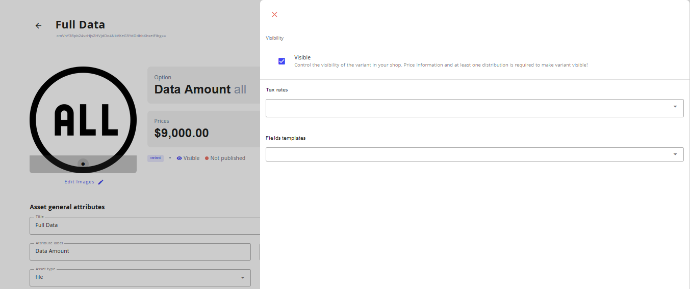

# Data offer creation

## Introduction

For the publishing, search and discovery of data available for sharing in the IIP-Ecosphere Data Marketplace three concepts are of relevance:

* Data Asset: Abstract description of the data offered.
* Variant: A collection of data, published or curated by a single agent, and available for access or download in one or more representations.
* Distribution: A specific representation of a dataset in a unique serialization.

The following diagram depicts the relationship between these concepts.
_Data Assets_ serve as an abstract representation of the data available for purchase.
They serve as an entry point to searching and browsing data in the marketplace catalog.
A Data Asset has one or more variants. Similar to a car that is available in several colors, a Data Asset can have several _Variants_ that differ e.g. in scope, creation date or release Version.
A _Distribution_ realizes the Variant as it describes a specific representation with own access mechanisms.
For example, a time series database can be shared by providing credentials or transferring its backup via FTP.

To publish a Data Asset all three classes need to be described.

```plantuml
abstract "Data Asset"
abstract "Variant"

"Data Asset"  - "1:n" Variant
Variant - "1:n" Distribution 


"Data Asset" : Title
"Data Asset" : Description
"Data Asset" : Vendor
"Data Asset" : ...

Variant : Scope
Variant : Version
Variant : ...

Distribution : AccessInformation"
Distribution : FileSize
Distribution : ...
```

This chapter describes how to create and publish data available for sharing in the marketplace catalog by relying on the three aforementioned concepts - starting with Data Assets.

## Create Data Assets

To start the creation of Data Assets, navigate to the Assets tab on the left hand side.
You will see all Data Assets created in your marketplace there. Using the admin application for the first time no Data Assets should be listed.
A new Data Asset can be creaeted by clicking on the 'Create New Asset' button.


This opens a 'Create New Asset' page, where the initial title and description of an asset need to be described.
The description field can be extended by clicking and dragging the lower frame downwards.


Upon click on the 'Create Asset' button a new Data Asset is created and the overview page opens.

As part of the asset generation process the data marketplace automatically assignes an initial image and slug for the Data Asset.
While the image is used for facilitated discovery of Data Assets by humans, the slug plays an important part in search engine optimization.
The inital price is zero and will be set during the creation of Variants.

In the fields of the bottom of the page title and description as well as aditional information or custom metadata can be edited.
The changes need to be confirmed in the upper right pop-up window.


### Edit images

Currently, the IIP-Ecosphere Data Marketplace supports either the integration of images based on a URL or base64 encoded images.
The integration of own images therefore requires the upload of the image to a reachable online storage or base64-encoding.
For the latter many free online services are available.

To change the initial image of a Data Asset or add a new image, click on the 'Edit Images' field below the thumbnail.
In the pop-up window either enter the image URL or the base64 code in  the already existing 'Image URL' fields.

To add a new image, simply click on the 'Add Image' field.
To remove an image, click on the red bucket next to the image you want to remove.
Click 'Save Changes' to confirm.


On the top of the asset page you find two additional tabs.
The 'Review' tab presents you with the reviews made for your Data Asset by the data buyers, once it is published.
The 'Variants' tab allows for the editing of Variants.
## Create Variants

To start with the creation or editing of Variants navigate to the 'Variants' tab of an existing Data Asset.
Existing Variants of a Data Asset are listed here.
For a newly created Data Asset there should be no variants.
The creation of a new variant is initiated by clicking on the 'Add First Variant' button.


In the opening pop-up window enter a title of the Variant to be created.
Also, it is mandatory to provide an Attribute and an Option that describe how a specific Variant differs from its peers.
The following table explains the function of variant titles and attribute labels.

> **_Note - Naming and describing variants:_**
> - Variant title: The Variant should be titled in a self-speaking way as the variant title will be used as name of the data offering and is therefore the first element potential data buyers will notice. 
> - Attribute label and option: The attribute label describes a certain characteristic that differentiates a Variant from other Variants of the same data offering. The specific property of the variant regarding the characteristic is to be defined. 
>> Examples for Attribute labels (characteristics) and Option (properties):
>>| Attribute label | Properties |
>>| --------| ----------- |
>>| Scope| full data, excerpt |
>>| Anonymization | differential privacy, hashing |

Similar to the creation of new Data Assets, a Variant is created by clicking on the 'Create Variant' button in the pop-up window.
Afterwards the Variant overview page appears.

The Asset overview page contains an overview of the most important properties of a Variant including its price, the related product, general attributes, additional information and custom metadata. 
Data can be maintained by filling the respective fields and confirming the notification on the top of the screen.

One attribute of specific relevance for search and discovery is the 'Asset type'.
The IIP-Ecosphere Data Marketplace already defines a range of possible Asset types and allows for their selection.
They include file, database, API or stream.

### Templates
To facilitate the creation of Data Assets and allow for their comparison and filtering during the data discovery process the IIP-Ecosphere Data Marketplace already comes with a collection of attributes recommended to be maintained for a holistic description of certain Data Asset types, so-called templates.
Templates are used on a Variant level.
The features of each template are distinct.
Thus, more than one template can be used to describe a Variant.
If a template is assigned to a Variant, only the needed fields can be maintained.


> **_Note - Templates:_** Currently the IIP-Ecosphere Data Marketplace supports a minimum viable amount of templates.
> This includes a template for the description of image data for AI applications ('Labelled Image Data'), for the description of data provided by Asset Administration Shells ('Asset Administration Shell') and for defining usage policies and personal data handling of an offered Data Asset ('Usage Control')


Templates can be assigned to a Variant by clicking on the gear icon on the top right of the Variant overview.
In the dopdown menu 'Fields templates' one or more templates can be selected.



Closing the menu leads to the appearance of the assigned templates on the bottom of the Variant overview.
To maintain the fields in a template uncolapse the overview by clicking on the plus symbol next to the template designation.
Template fields are maintained in the same way as regular fields.


> _Troubleshooting:_ If a template does not appear after closing the menu please refresh the Variant overview page.

### Pricing

Setting the price for a Data Asset or in this case its variant is one of the most important parts in Data Monetization.
The IIP-Ecosphere Data Marketplace supports different pricing models such as free of charge, one-time fee, subscription or custom quotes.
To set the price for a Variant navigate from the Variant overview to the 'Pricing' tab.

 

First, choose the matching pricing model for your offer by selecting an option in the 'Model type' field.
You can specify the price model further by setting certain restricitons for download volume, download quantity or a time frame for which the data will be available.
Under the price information section set the targeted price for the Variant.
Save all changes by clicking on the 'Save Changes' button in the pop-up window.
As all listed prices are net prices, value added tax information needs to be assigned.
VAT information is defined during the [store configuration](/docs/admin/store-configuration.md).
To assign the defined VAT rate to the distribution click on the gear symbol on the top right and select the appropriate previously defined tax rate.

 

## Create Distributions
To describe the serialisation of the data variant and hence the method of how access to data will be given at least one Distribution for a Variant needs to be created.
To this end, navigate to the 'Distributions' tab and click on the 'Add Distribution' field.

 

The Distribution creation window opens.
It gives you the chance to name and describe the distribution you want to create.
The field 'Distribution type' gives the opportunity to select one of the predefined categories for distributions such as file, database or URL - giving a hint to how the data will be delivered to the buyer.
Further, access information to the data can be maintained.
Please only use this option when you want to provide open access to a data asset as this information will be visible for everyone seeing the offer.
Lastly, further metadata can be added to the distribution. For instance, it is recommended to describe the format as it helps potential customers to evaluate, if they are able to work with the data as provided.
To finalize the creation of the distribution click on 'Add Distribution'

 


## Publishing a Data Asset in the catalog
The created Data Asset and its related Variant and Distribution are initially internal.
To publish the data asset to a catalog and make it visible for potential buyers at least one Variant and one Distribution for a Data Asset need to be created.
In a first step, at least one Variant of a Data Asset needs to be made visible.
This is possible by navigating to the Variant to be made available and clicking on the blue gear in the top right corner.
In the opening window, make sure that the box next to the option 'Visible' is checked.
Go back to the Data Asset page and repeat the same sequence for the Data Asset.
In the same menu click on the button 'Publish in catalog' to make the Data Asset available for purchase.


> **_Note - Publishing changes:_**
> To make changes to an already published Data Asset appear in the storefront application catalog the Data Asset must be republished.
> To republish a data asset navigate to the Data Asset, click on the gear in the top right corner and then click on the button 'Asset is published. Republish changes'.

### Control the visibility of Data Assets
The IIP-Ecosphere further allows for a finer-grained control of Data Asset visibility based on user accounts.
Two options are available.
In the first option, Data Asset visibility is disabled by default and parties allowed to see the Data Asset in the catalog are specifically defined.
In the second option, Data Asset visibility is generally enabled, while certain parties can be excluded.
To start restricting the visibility of a Data Asset, activate the 'Private' slider under the 'Access' section in the sidebar.
Below, you select either 'Allow' to enable visibility option one or 'Prohibit' to enable visibility option two.
In the text box below maintain the accounts for which you want to either allow or prohibit the visibility of a Data Asset.

## Clone a Data Asset

To facilitate the creation of a new Data Asset similar to an existing Data Asset the existing Data Asset can be cloned and then edited.
To clone a Data Asset navigate to its asset overview page.
Then, click on the blue gear on the top left corner.
To finalize the copy of a Data Asset, click on the 'Clone' button and exit the menu. 
The green notification on the top left signalizes the successful creation of a clone. 
The duplicated Data Asset appears in the 'Assets' tab and can be edited like any regular Data Asset without any dependencies to the original Data Asset.