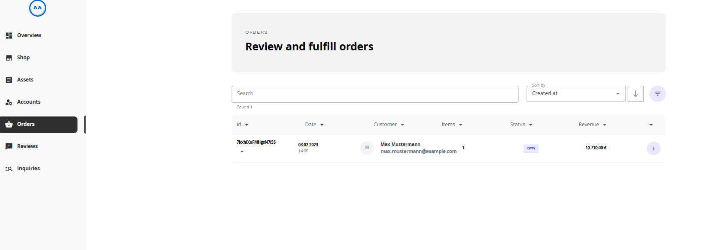
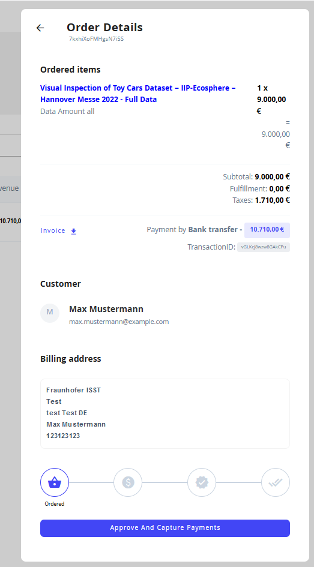
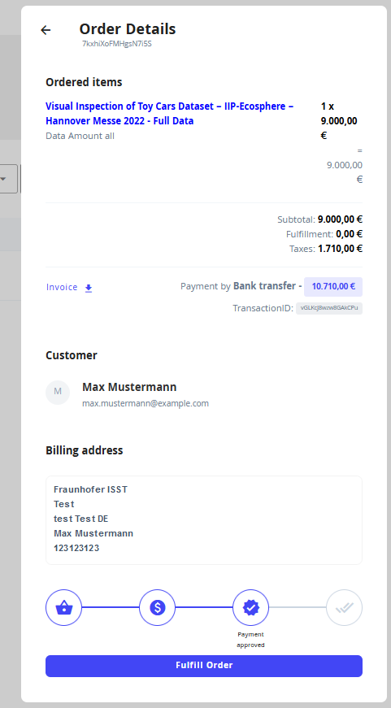
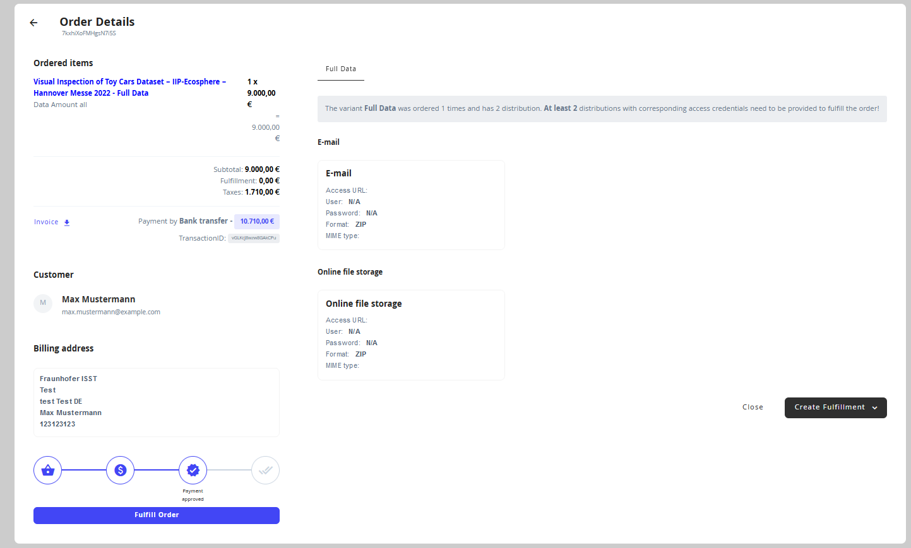

# Fullfil orders

## Introduction

Once a data buyer made an order for one of the Data Assets offered in a stores catalog, the data provider is responsible for the fulfillment.
The fulfillment takes place in interaction between buyer and provider.

This section covers the necessary steps from a data providers perspective.

Once a purchase offer has been made, navigate to the 'Orders' tab in the admin application.
Open orders are shown in the overview page and can be and can be searched and sorted.

To examine an order in greater detail and start with the fulfillment process click on the three dots on the right side of the table. 

The 'Order Details' pop-up opens and reveals more information about the order. 
This entails the 'Data Asset' to be given away, the buyer and their contact details, the invoice amount and biling address.

>🕰 To continue further with the fulfillment process the data provider needs to wait for the data buyer to pay the agreed amount.

In the bottom of the pop-up window, the buyer can approve the invoice and payment once the amount has been transferred by the buyer. To this end, click on 'Approve And Capture Payments'.

This leads to a continuation of the process flow, which is depicted in the bottom of the 'Order Details' pop-up.
In the pop-up click on 'Fulfill Order' to deliver the data to the buyer.

This opens the order details page. Indicating the Distributions agreed for delivery.
Click on each Distribution to enter credentials that can be directly delivered to the buyer.
If a Distribution is delivered by other means (e.g. Email or FTP transfer) this needs to take place outside of the data marketplace in this step.
Click on 'Create Fulfillment' to deliver the Distribution credentials maintained in the marketplace to the data buyer.

A successful fulfillment is indicated by a completed workflow in the 'Order Details' pop-up and also indicated in the order overview.   