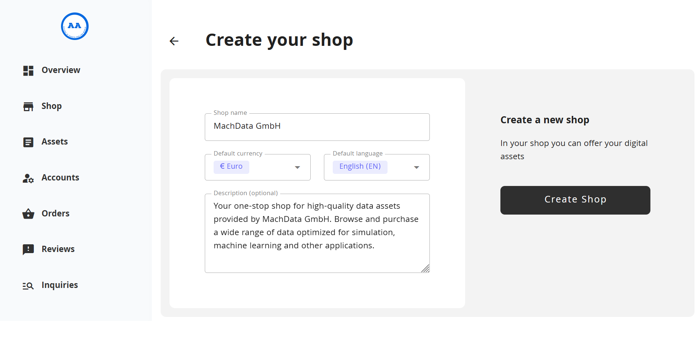
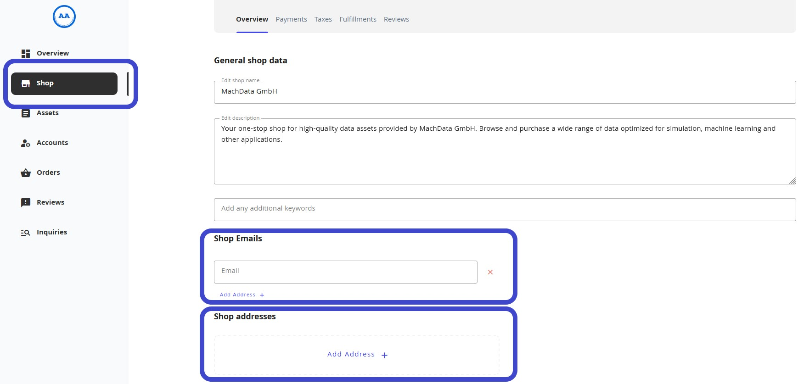
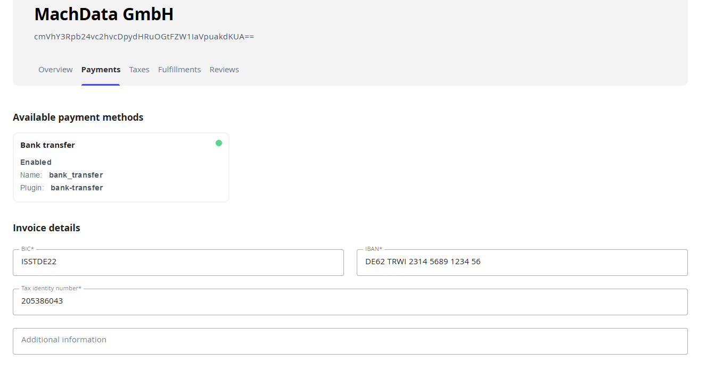

# Store configuration

## Introduction

The IIP-Ecosphere Data Marketplace demands the creation, maintenance and delivery of data assets through a store. Each data providing entity sets up such an individual store to allow for the highest self-determination regarding to the description and listing of their data assets.
Further, the stores are used to interact with workflows in the areas of fulfillment and payments. Essential information to support these processes (e.g. master data) needs to be provided before being able to correctly list the data assets to be sold.

This document describes the steps required to set up and configure a data store in the admin application.

## Getting started

Upon first start of the admin application users need to register a new account by setting an email address and password.

To start create a new empty shell of a store a new shop name, currency, language and store description need to be set in the following dialog 'Create your shop'.
A new store is created by clicking on the button 'Create Shop'.

## Set up contact information

To allow for trustful data sharing and to leverage the integrated invoicing and fulfillment functions the IIP-Ecosphere Data Marketplace lets you maintain general contact information applying to all data assets listed in a store.

Contact information can be maintained by navigating to the 'Shop' tab on the left hand side of the admin application.

A new email address is registered by entering the address in the 'Email' field and confirming the process in the appearing pop-up window.

The shop address refers to the legal address of the data providing enterprise and is  used e.g. in the billing and fulfillment process.
To enter a new address simply click on the 'Add Address' field and enter the address details in the opening pop-up window.

Upon successful creation of email and shop address the user receives a confirmation on the top left of the screen.

## Set up payment information

As it represents the most popular payment method in B2B transactions the IIP-Ecosphere Data Marketplace currently supports purchases on account as only payment method.
Therefore store owners need to enter their bank account information during the store setup.
Bank account information can be maintained under the 'Payments' tab in the 'Shop' category.
IBAN and BIC are entered in the respective fields and confirmed in the appearing pop-up window.
Additionally the value added tax identifier of the enterprise can maintained here.
This information will also be part of the invoice documents.

## Fulfillments

Fulfillments refer to the process of delivering a product after its inquiry.
While in general several fulfillment methods are possible, the IIP-Ecosphere Data Marketplace currently focuses on the digital delivery of data assets.
This method comprises  fulfillment options such as providing credentials to a database, transmitting files via FTP or executing code on a provided data asset.
By default there is no price assigned to fulfill the orders. 
However it is possible that fulfillments will receive a cost in order to price externalities such as data preparation or generation of user accounts for data access.
