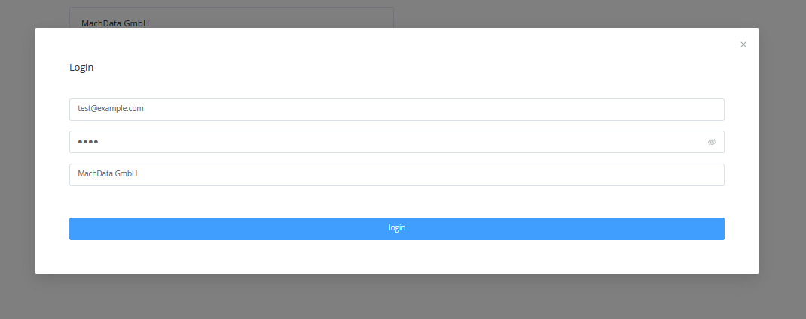
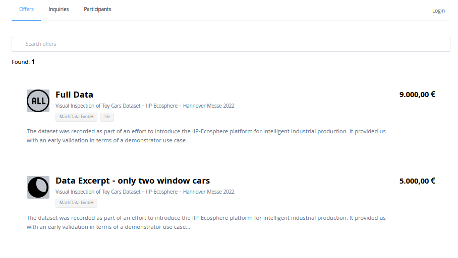
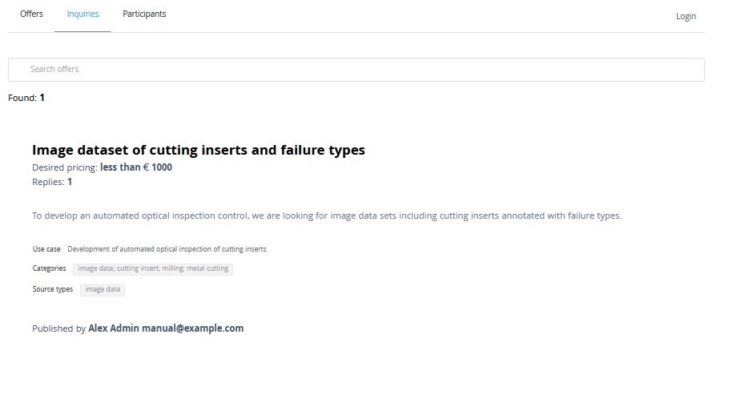
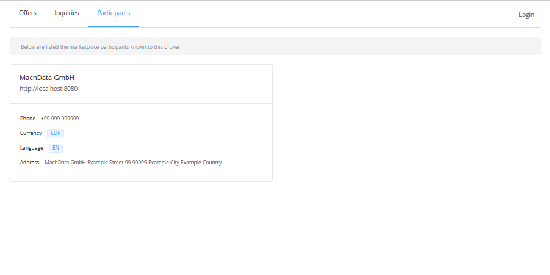

# Data Marketplace Broker

## Introduction

The IIP-Ecosphere Data Marketplace broker enables the federation of Data Asset offers and inquiries from registered IIP-Ecosphere Data Marketplace storefront applications.
While showing the available data offers, it respects the visibility conditions defined in each marketplace instance.

## Register Data Marketplace storefront
In order to enable the crawling of data offers of a specific data marketplace storefront, it needs to be registered in the Data Marketplace broker.
Marketplaces to be crawled by the broker have to be listed in the environment variables during deployment.
The example below depicts the inclusion of a locally deployed marketplace with an API endpoint reachable under `http://localhost:3000/graphql` and a storefront at `http://localhost:8080`.

```
PORT=4000 # port of the server where the frontend is served
NUXT_KNOWN_NODES_CONFIG='
[
  {
    "apiEndpoint": "http://localhost:3000/graphql",
    "storefront": "http://localhost:8080"
  }
]
'
NUXT_FRONTEND_BASE_URL=http://localhost:4000
NUXT_BROKER_API_ENDPOINT=http://172.17.0.1:4000/api

```

## Login
Broker users can re-use their login data of their origin data marketplace to be potentially able to see data offers with limited visibility. 
To log in, click on the login field on the top right of the page.
Enter your account email and credentials and select your origin data marketplace by its name or address from the list.
Click on the 'login' field to confirm. 



## Browse offers
To browse the offers of all participating data marketplace storefronts, navigate to the 'Offers' tab. 
A list of all crawled offers is presented. 
The list of offers contains offer names, their tags, and their prices.
Listed offers can be searched by the search bar in the top of the page. 
By clicking on a data offer, the user is forwarded to the data offer in the origin marketplace storefront.



## Browse inquiries
To browse the inquiries described on all participating data marketplace storefronts, navigate to the 'Inquiries' tab. 
A list of all crawled inquiries is presented.
Crawled information includes the names, use cases, tags, desired pricing, and contact information.
Listed inquiries can be searched by the search bar in the top of the page. 
By clicking on a data inquiry, the user is forwarded to data inquiry in the origin marketplace storefront.




## Browse participants
To get an overview of all participating data marketplace storefronts and further information about each marketplace, navigate to the 'Participants' tab. 
A list of all participants is provided, including further information such as contact data, address or currency. 

