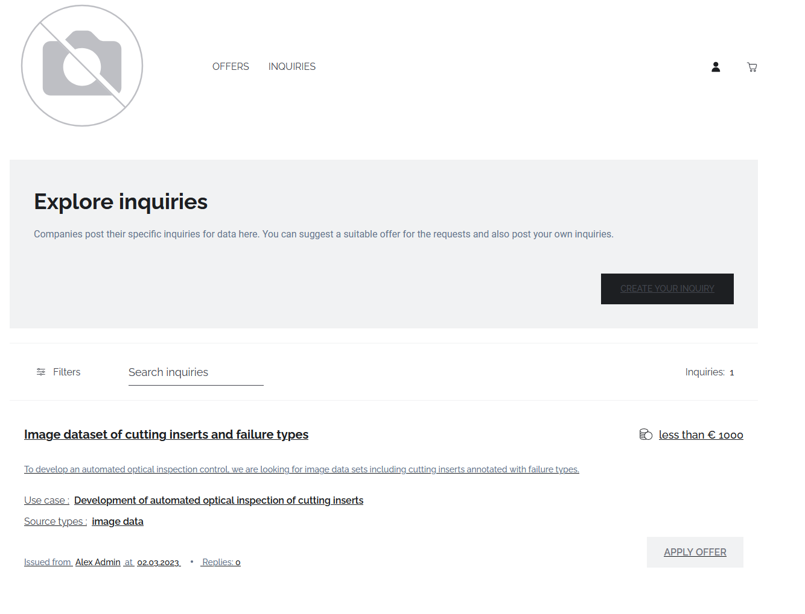
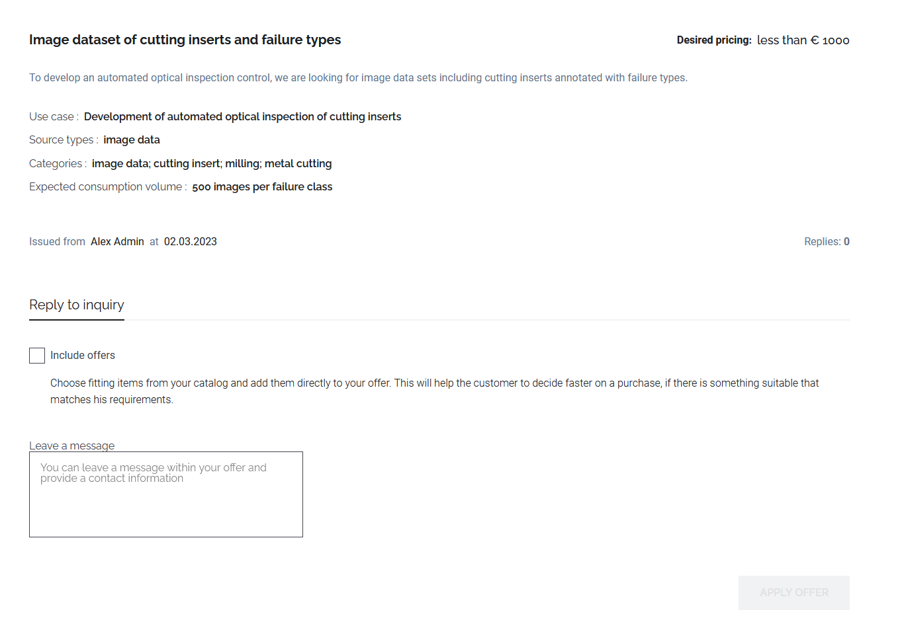
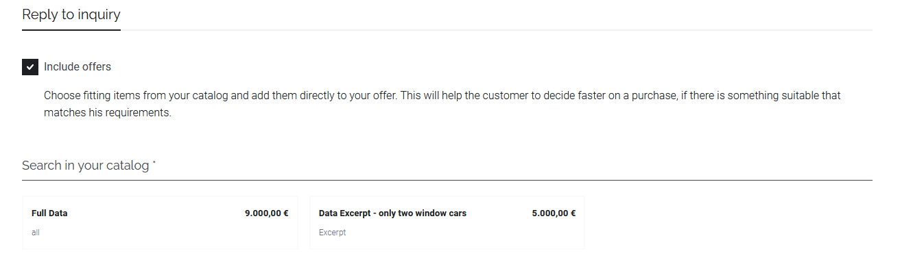
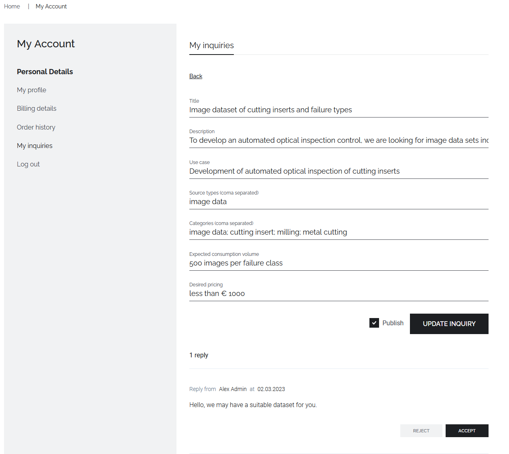

# Discover and react to data inquiries

## Discover data inquiry

To discover existing data inquiries, navigate to the 'Inquiries' tab in the storefront home.
Existing data inquiries are listed and can be searched or filtered the same way as [data offers](./purchase-data-assets.md#discover-data-offers)

## Propose matching data

Once a matching data inquiry could be found, the data offer can be examined in greater detail by clicking on its title.

If you can offer a data set matching the criteria of the data inquiry, you can contact the data inquirer by two means.
First, a data inquirer can be contacted by clicking on its name in the data inquiry to receive contact data to send a message outside of the data marketplace.
Second, a reply to the data inquiry can be send within the data marketplace.
To this end, fill out the message field below the data offer.
In case you want to include a data asset already listed on the data marketplace, check the box 'Include offers' and select the matching data offer.
To transmit the reply to the data inquirer, click on the 'Apply Offer' button.

## Accept data proposal
Once possibly matching data assets have been proposed to the data inquirer via the data marketplace, the data inquirer can accept or reject these proposals to give the possible data suppliers further feedback.

To react to a message proposing a matching data asset, navigate to the 'My Inquiries' section under the 'My Account' section. 
All replies concerning a data inquiry are listed below the respective inquiry.'
The user has the chance to directly accept or reject a data offer by clicking on the 'Accept' or 'Reject' button listed below the message.
Further, as the contact is shown, the potential provider can be contacted for further information

