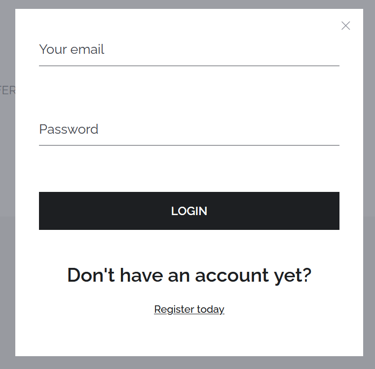
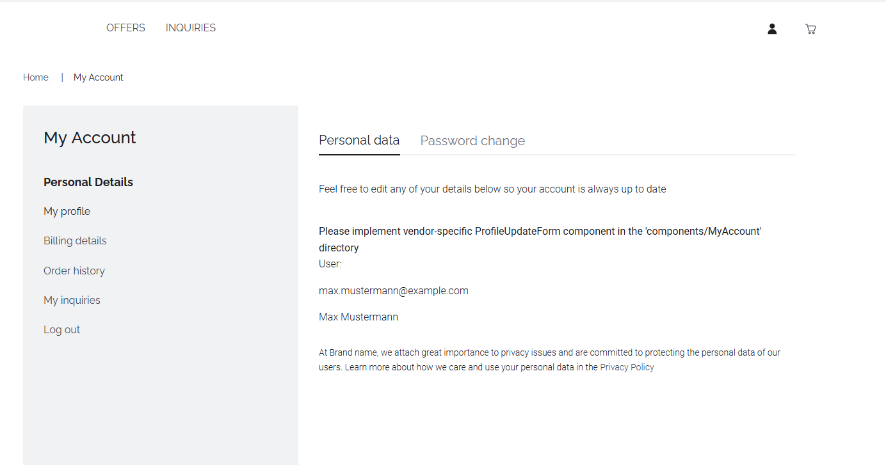

# Getting started

## Introduction
The IIP-Ecosphere Data Marketplace provides discovery and purchase of Data Assets as well as data inquiries through the storefront application.
Each store of a data vendor has an associated storefront.
To make full use of the storefront application data buyers need to be registered register and maintain some data supporting the purchasing processes.  

This document describes the steps required to set up and configure a such a user account.

## Register and Log-in

Prior to using the storefront, the data marketplace provider needs to register an account for the marketplace user and provide the credentials.

To log in with the provided account details, click on the person-shaped icon on the right top of the page.
In the login mask enter your data and click on the 'LOGIN' button.

You will be redirected to the storefront home screen.
The filled person-shaped icon and shopping cart indicate a successful login.

## Edit billing details

To facilitate the workflow of data purchase and fulfillment it is recommended to maintain some user data for billing purposes prior to any purchase.
This data may be reused in recurring or subsequent purchases and avoids the task of submitting new user data forms for each purchase.

To edit billing details click on the person-shaped icon.

On the left hand side click on the 'Billing details' text.
Afterwards click on the 'ADD NEW ADDRESS' button.

## Show existing orders and inquiries

Past orders an existing data inquiries can be analyzed under the 'My Account' section. 
To get to the section click on the person-shaped icon on the top right.
To see the order history click on 'Order history'.
To get an overview about past data inquiries, click on 'My inquiries'.
