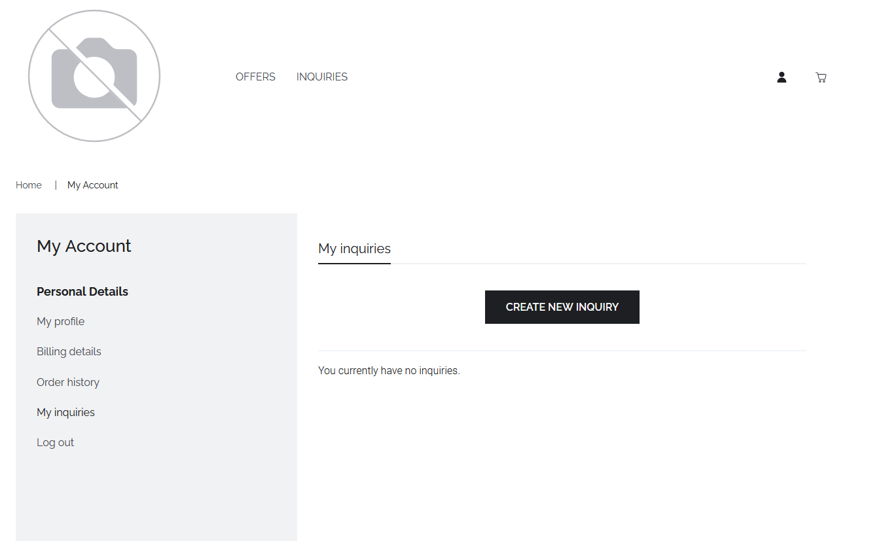

# Submitting data inquiries

## Preconditions
To be able to pose data inquiries, you must have an active marketplace account and be logged in.

## Create data inquiries
On the storefront homepage, click on the inquiries tab to show existing data inquiries or start to create a new inquiry.
While in the top existing inquiries are shown, the button 'CREATE YOUR INQUIRY' enables users to start the data inquiry creation workflow

Clicking the button forwards to the 'My Account' page where clicking on 'CREATE NEW INQUIRY' enables to start the creation of a new data inquiry.

The following image shows the input mask. To deliver a straightforward data inquiry, followin information should be provided: 
* Title: Short title of the data inquiry
* Description: Precise description of the needed data and the envisioned usage
* Use Case: Use case name
* Source Types: Names of accepted source types
* Categories: Tags of the data category needed
* Expected consumption volume: Data needed (in entities, frequency, volume)
* Desired pricing: Fee text field to give any indication about an expected price or fee

After the needed data inquiry information is provided, mark the publish checkbox and click on 'CREATE INQUIRY' to publish the data inquiry on the data marketplace.

Once the data inquiry has been published, it can be managed in the 'My Account' view under the 'My inquiries' tab.

The published data inquiry is discoverable via the Inquiries section in the storefront.