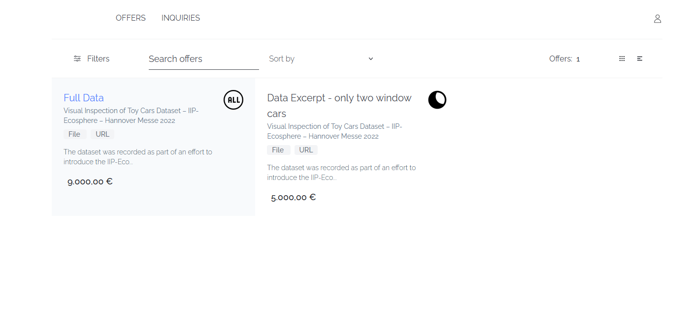
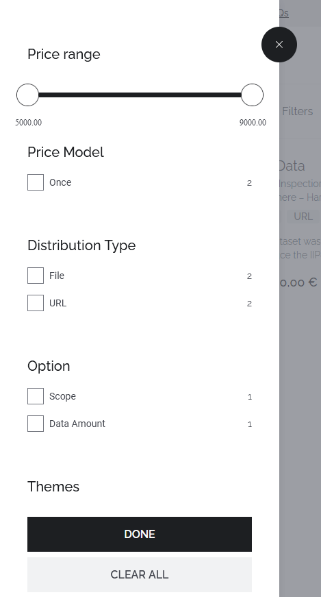
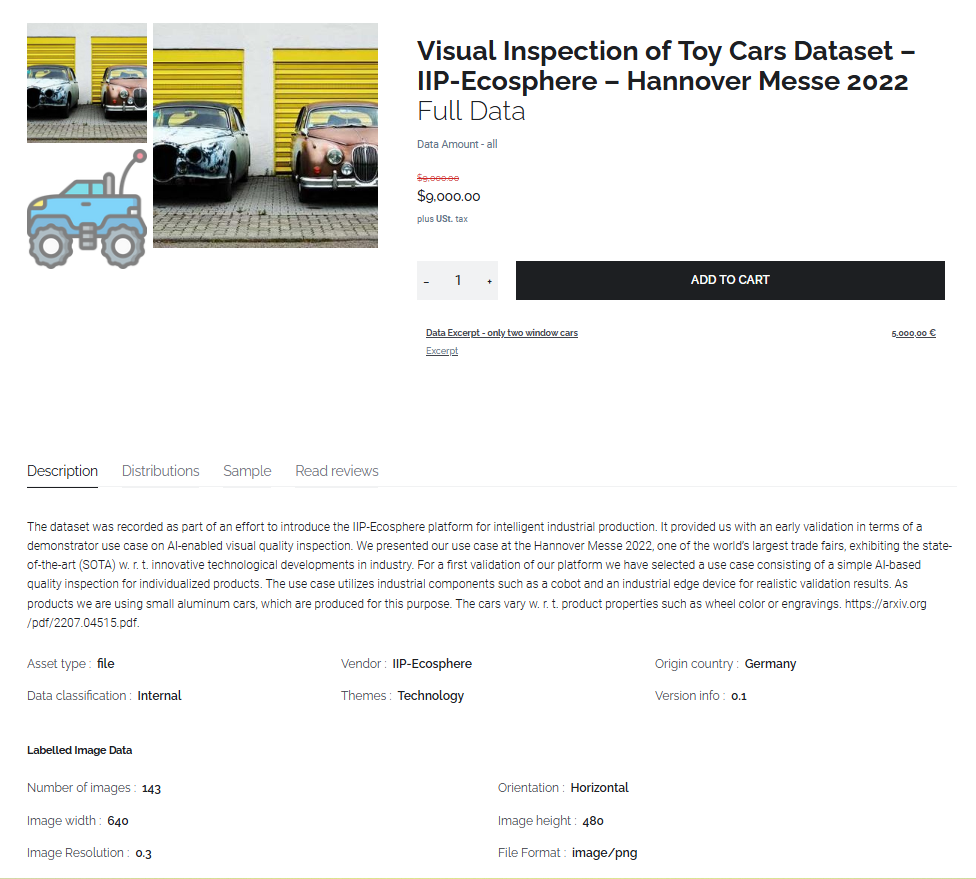
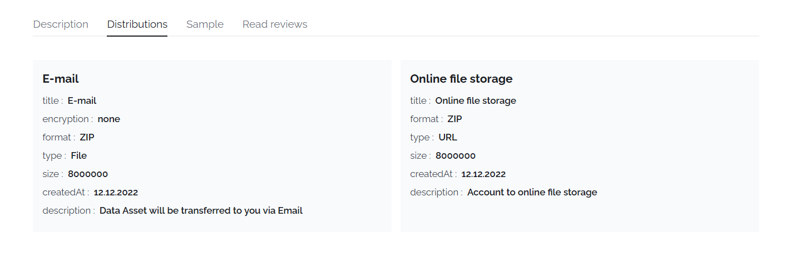
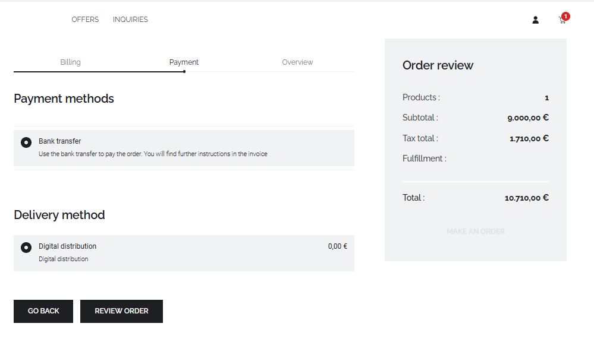
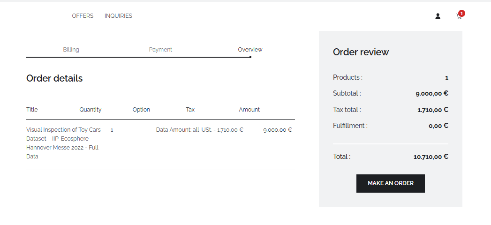
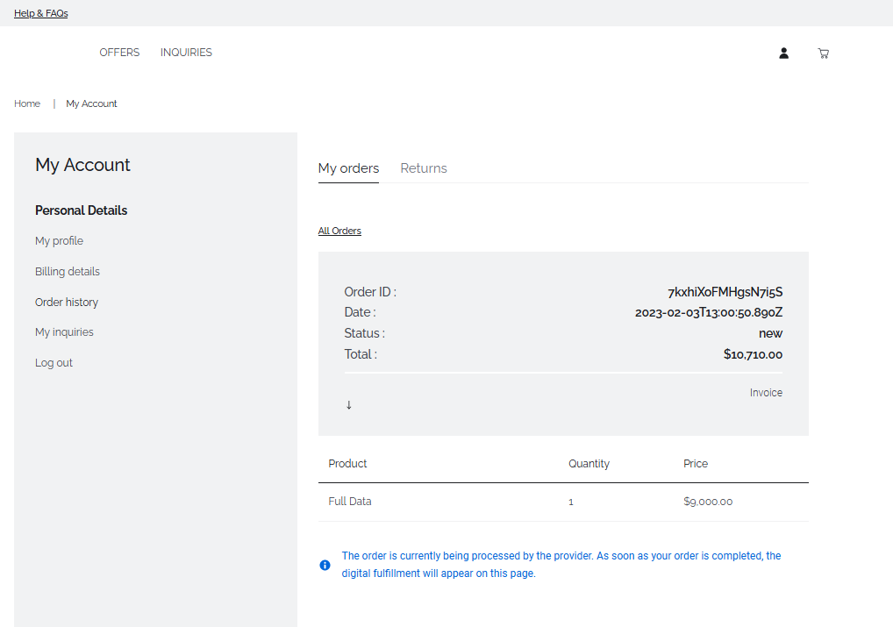

# Data Purchasing

## Introduction

This section deals with the central value promise of the IIP-ECosphere Data Marketplace for potential data buyers: finding the right data for their purpose, buying and getting access to the data.

Therefore, first the Data Discovery process and options are explained.
Afterwards, the data shopping process is described.
Lastly, it is explained how physical access to the data is provided by the data seller.

To conduct all of the above steps, data buyers needs to be registered and logged in to their account. 

## Discover data offers

To initiate the search for potentially useful data click on the 'Offers' tab on the storefront home screen.
This opens an overview of all data offers available in the store.
Currently, each Variant of a Data Asset is shown as data offer. 
The view of Variants can be changed from standard tile view to lone view by clicking either the line or tile icons on the top right.

To find the data needed for a specific use cases the IIP-Ecosphere offers provides different capabilities.

> _Note_: Prices of data offers are always shown without VAT.

### Search
The free text search is a user-friendly option to find data offers for users.
To search for one or more specific terms type those into the 'Search offers' field in the center of the offers page.
Matching data offers will be automatically presented to you.  

> _Note_: The search looks up if the desired terms are present in the header of each Variant. The header includes the Data Asset name, the Variant name and also related Variants of the same Data Asset. 

### Filter

All exiting data offers can be searched according to metadata described during the data offer creation.
These metadata attributes include price model, pricing, Distribution types, Themes, Vendor and other information maintained on Variant and Data Asset level.
To filter data offers, click on the switches icon on the left hand side and select the filters in the filter selection. 
The bold text describes the characteristic while the checkboxes describe the attributes.
Apply all selected filters to all data offers by clicking on the 'DONE' button.

## Analyze selected data offer
To examine a data offer in more detail click on the relevant data offer in the offers overview.

In the header attributes such as the name of the Data Asset and Variant as well as pricing and other Variants for the same Data Asset are shown.
You can jump to another Variant related to the same Data Asset by clicking on the link.
In the lower part of the page all maintained metadata is depicted.
This includes the description and metadata maintained on Data Asset level as well as additional attributes assigned using templates to the Variant.
To examine the provided Distributions click on the 'Distributions' tab.
To see reviews by past buyers of the data navigate to the 'Read reviews' tab.

## Purchase data

To start the data purchasing process click on the 'ADD TO CART' button in the detailed view of a data offering. 
The data gets added to the shopping cart and an icon with the number of items in the cart appears in top right corner.
Once all data to be purchased are added to the cart, click on the cart to open the shopping cart overview. 

Items in the shopping cart that are not needed can be deleted by hovering over the element and clicking on the 'x' button.
If all items in the shopping cart are correct, click on 'GO TO CHECKOUT' to continue with the ordering process. 

The billing information maintained in your user account will automatically be used during the purchasing process and as fulfillment infiormation.
Therefore, there is no need to provide further billing details and your are forwarded to the 'Payment' window. 

The 'Payment' window gives an overview about possible payment and fulfillment methods. 
Currently the data marketplace provides the purchase on account as payment option.
For data as digital goods digital distribution is supported as fulfillment method.
More payment instructions will be defined in invoice.
To continue select the payment and delivery method checkboxes to agree and click on 'REVIEW ORDER' to move to the last step of the ordering process.

In the 'Overview' window the order details can be verified before purchase.
In case of wrong information Click on 'GO BACK' to correct the data.
Finalize and confirm the order by clicking on the 'Make an order button'.

To confirm the order placement a successful order message appears.
This message indicates the party and contact to fulfill your order.

## Check orders

Once the order placement was successful open orders can be inspected in the 'My Account' section. 
To see open orders go to the 'My Account' section by clicking on the person-shaped icon in the top right of the storefront and navigate to the 'Order history'.
This shows the open order including its price and further metadata. 
It also lets you download the corresponding invoice automatically generated by the IIP-Ecosphere Data Marketplace.

##Payment

To finalize the purchasing process from the buyers' side the data buyer needs to pay the amount according to the created invoice to the data provider.

## Retrieve data

>🕰 To continue further with the purchasing process the data buyer needs to wait for the data seller to approve the order.

Once the fulfillment process has been completed by the data provider.
The data provider either transferred the data to the buyer directly outside of the marketplace or provided the credentials during the fulfillment process.
To retrieve the credentials navigate to  to the order history.
Go to the completed order and click on 'View details'.
Under the section 'Order Fulfillment' click on the Distribution to obtain the credentials. 

